# smart-car-baidu---

飞思卡尔智能车17届完全模型组部分资料开源
由于我们组只是来玩智能车的，对奖项和速度没有太高的欲望
因此把时间精力花在了优化调车体验上面，现在进行一个简单的分享
希望对大家有所帮助，再接再厉，骚的飞起
-------------------------------------------------------------------------由于本人考研备考中，更新较慢，将就着看）

___

[TOC]

# 目录：

- edgeboard端网络连接优化
- 车壳3D建模
- 机械结构优化
- 单片机布局优化

---

## edgeboard端网络连接优化
  首先就是大家都头疼的一个问题,网卡的适配问题.
  我们队先后尝试过官方的无线网卡,网线连接,其他驱动移植等方法,效果都不太理想.
  在经历了两天,拖着三米长的网线跟着车跑的尴尬局面之后,本人忍无可忍,想到了一个非常天才的解决方法,最终实现效果好极了.

<iframe height=300 width=300 src="./Picture/4c67c7f59180d53710e990d83695abe6.mp4">

   实现的思路其实群里有老哥也已经发现了,既然网卡出错的原因是USB带宽不足,那干脆就不走USB口

   一开始本来是想用串口的,毕竟摄像头组别的无线图传也比较成熟了,无论是自己开发还是成品都可以买,但也有老哥提到edgeboard的串口也存在延迟,而且这个方案的上限太低了

   最后感谢万能的淘宝,找到了给摄像头监控用的无线网桥,原理是把rj45有线网的信号转成无线网络进行数据传输,从实现原理上达到了免驱,实际使用效果还行

   这里就不放链接了,毕竟我们当时时间宝贵,直接买了200+的5g版本,事实证明根本跑不了这么高的速度,理论上只要是无线网桥就行,大家备战18届的有充足的时间踩坑(๑*◡*๑)(好吧给土豪们留一个算了https://m.tb.cn/h.fyRJVZz?tk=CkEd2sIl2ku)

   最终的实现效果上,网络连接非常稳定,传输小的视频流没什么压力,命令行无延迟,基本实现了所有的需求.

---

## 车壳3D建模

​	开源一部分车壳的建模,仅供大家标定尺寸,放在moddle目录下,无法直接3D打印,必须修改,希望大家充分发挥自己的创意
​下图中红框的四个孔位以及蓝圈中的轮胎开孔已经打印测试,误差在可以接受的范围内,其他部分请针对自己的机械结构自行修改

 下图中红框的四个孔位以及蓝圈中的轮胎开孔已经打印测试,误差在可以接受的范围内,其他部分请针对自己的机械结构自行修改

 下图中红框的四个孔位以及蓝圈中的轮胎开孔已经打印测试,误差在可以接受的范围内,其他部分请针对自己的机械结构自行修改

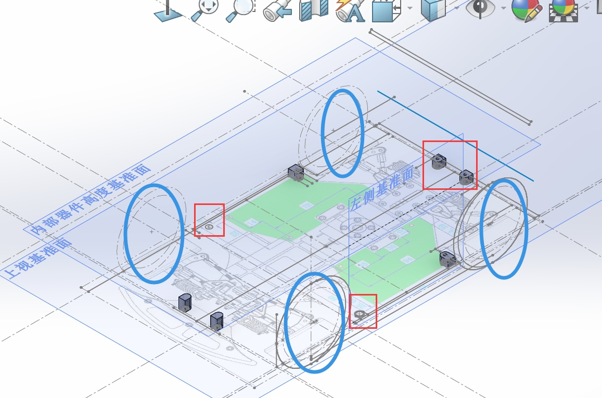

	基准面说明:
	上视基准面为底面
	左视基准面为外壳左面靠内侧
	内部器件高度基准面为官方edgeboard摆放的高度,引擎盖部分需要比这个高

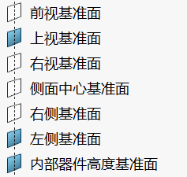

	建模注意事项:
	如果不打算预留防撞板的话,车壳最前端到舵机的高度变化非常距离,需要处理好
	由于此车模前轮打角范围很大,建模时一定要留出足够大的空间,大致像下图画的轮廓做一个切割
	摄像头开孔建议自行设计方便拆卸
	底部固定孔位建议花点心思弄成金属孔位,否则多次拆卸会造成孔位松动难以固定

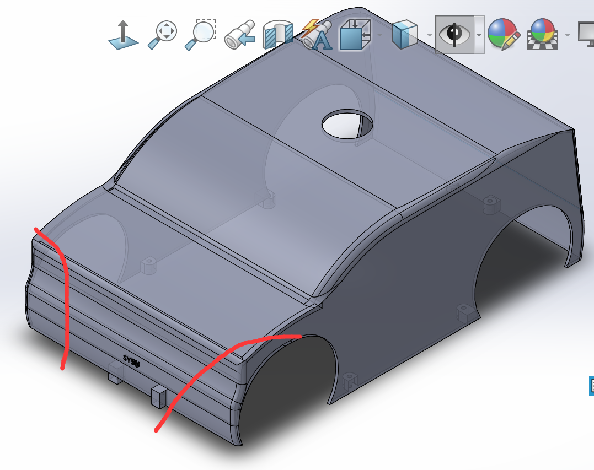

---

## 机械结构优化

### I车模的特点

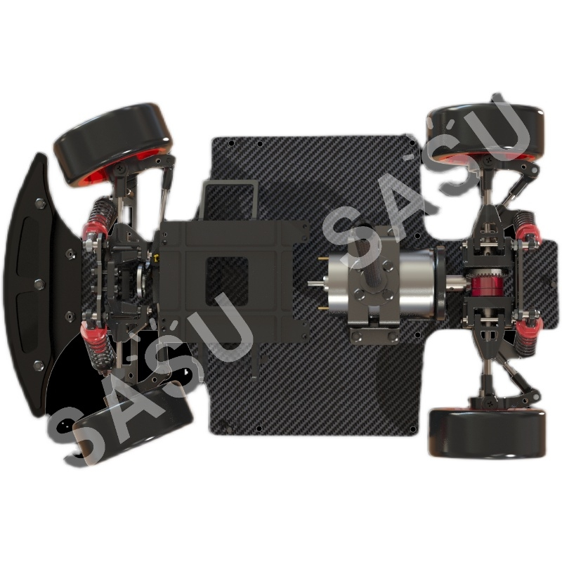

1. 电机在中间,对布局有非常大的影响,两侧的宽度基本上只能放进去TC264核心板

2. 对外围器件的硬性要求很低,由于外壳的存在,屏幕可以不设计,走线简化了很多;单驱单编码器外加一个舵机以及串口,就可以达到完成任务的最低要求

3. 如果想像传统组别一样主驱分离,那主板跟驱动板基本上只能放在电机的两侧,再考虑到edgeboard的供电以及空间占用,以及电池到驱动板,驱动板到主板以及edgeboard之间都需要走大电流,走线上很难做到美观.

   

---

### 初代布局方案

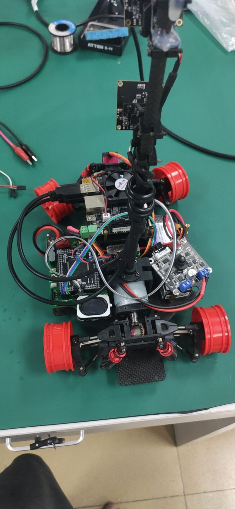

​	 

​    可以看到:

- 线路杂乱,且电源线无法避免,驱动分离的设计引入了两根电机线加上两根电源线以及至少三根驱动控制线
- 没有位置抓车,不方便日常调车,特别是这辆车还很重的情况下
- edgeboard的位置和方向导致摄像头等USB排线会超出外壳的范围,导致必须使用拓展坞,这又会占用我们宝贵的空间
- edgeboard默认的支架位置实际上压缩了我们主控板的可用空间,进一步加大了画板难度,实际上这里已经把原来电池支架的位置锯掉然后将电池放在右侧,以增大主控板的可用面积

---

### 本人的布局思路

#### 布局设计

​	首先,本人的目标是留出右侧一部分的空余空间用于拿车,然后尽可能给主控板留出足够大的空间,最后自行设计edgeboard的支架以及朝向,解决线路突出外壳的问题,而所有的这一切的主要难点就在解决固定孔位与电机位置的协调上

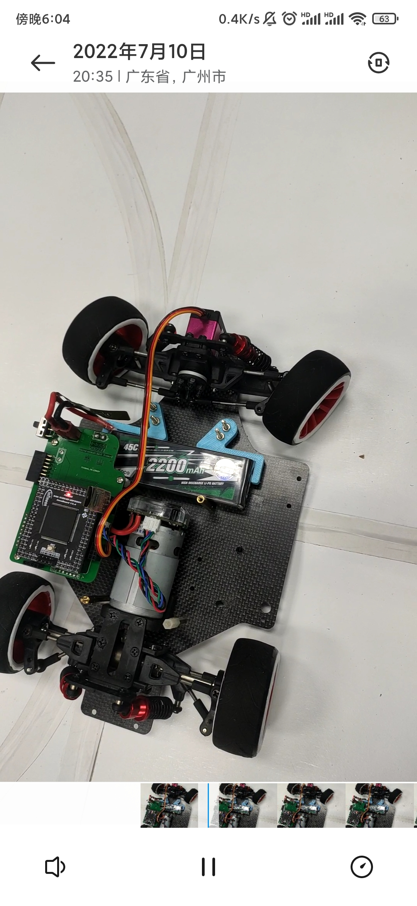

 上图就是本人设计的简易电池支架,有3D打印机的话20分钟就能设计并且打印出来,一共四个固定孔位,其中下面两个是底板自带的,上面两个是随便用电钻钻出来的.
  之所以设计成左右两个,一是因为电钻打出来有误差,不怎么对称,二是为了更好的固定电池,如下图,水平方向上电池已经被固定的很好,拆卸是只需要把电池往上扣即可,但由于安装车壳时还需要保证翻过来电池也不会掉,故采取了一点骚操作,仔细观察就可以发现,电池的正负极两根大粗线的中间是卡进支架的,利用这个设计就可以保证翻转时电池不掉落.拆卸电池时只需要拔掉板子上的端口即可抠出来.

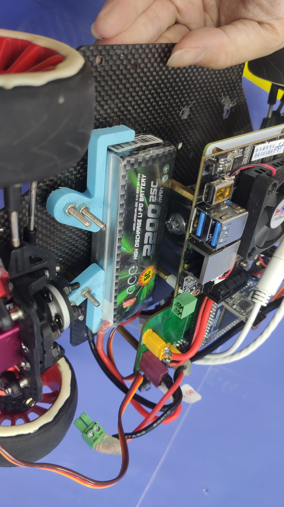

  解决了电池之后edgeboard支架便只剩下悬空edgeboard一个功能,因此本人调整了一下方向之后把位置往右稍微挪动了一点,并且把摄像头的固定孔位与其一起画到了PCB上面,如下图,此电路板最大的好处就是,布局的权限已经**==完全开放==**

  
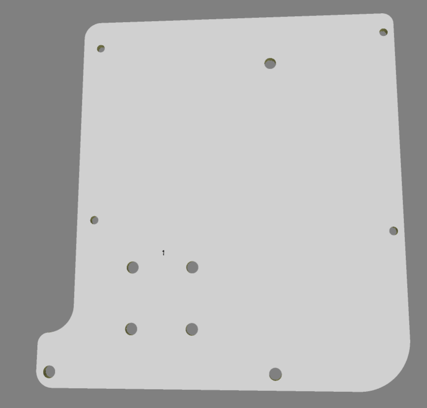

用户可以自己决定edgeboard的位置,也就可以随意决定主控板的大小,**==完全不需要担心被edgeboard支架以及摄像头支架限制==**

最终的实现效果如图所示

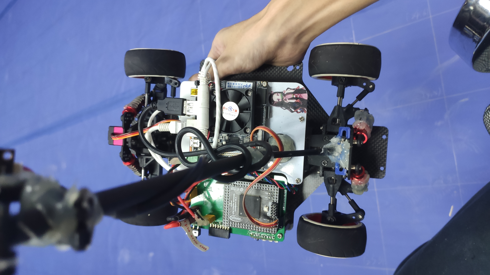

再把之前提到的网卡加上,位置也是刚刚好卡死,非常nice

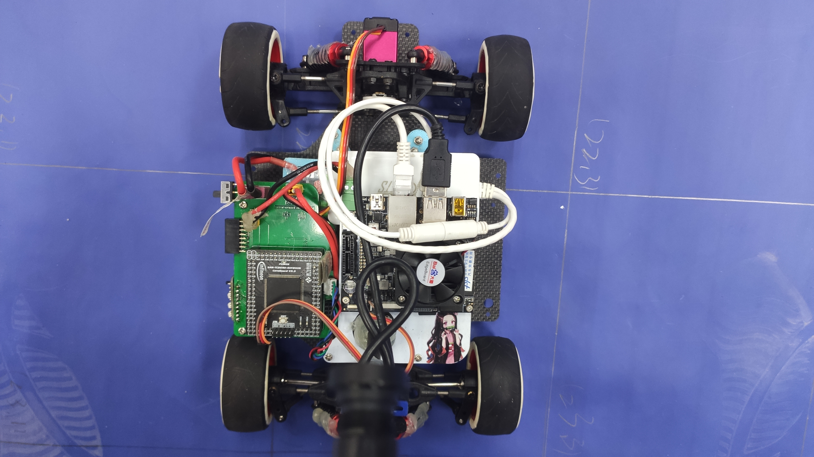

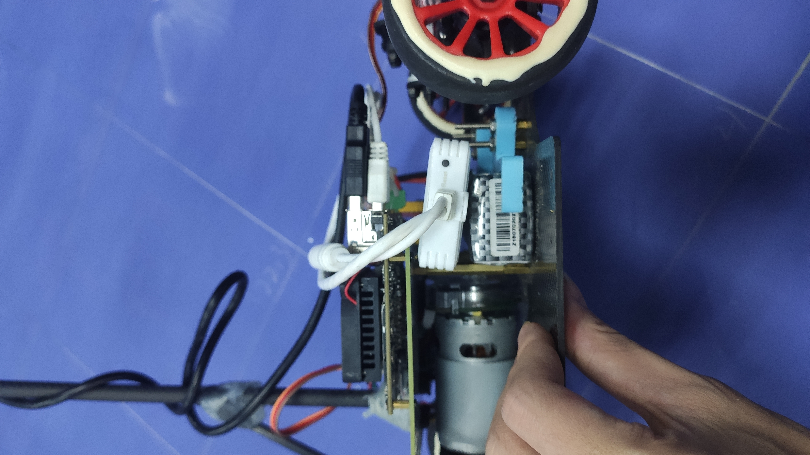

#### 单板集成
​	反正立创开放了四层乃至六层板免费的打样服务,使用一块板子集成主控,电源转换以及驱动的功能,优点是大幅度减少了各种线,达到了强迫症勉强接受的程度,只剩下电池线,电机线,edgeboard供电线等无法减少的接线.

​	缺点就是这个组别的煞笔舵机经常烧,不设计限流的话很容易焊板子焊到不省人事,没有主驱分离来的保险

---
